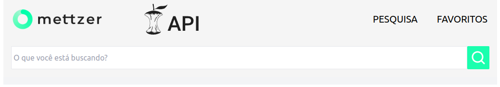
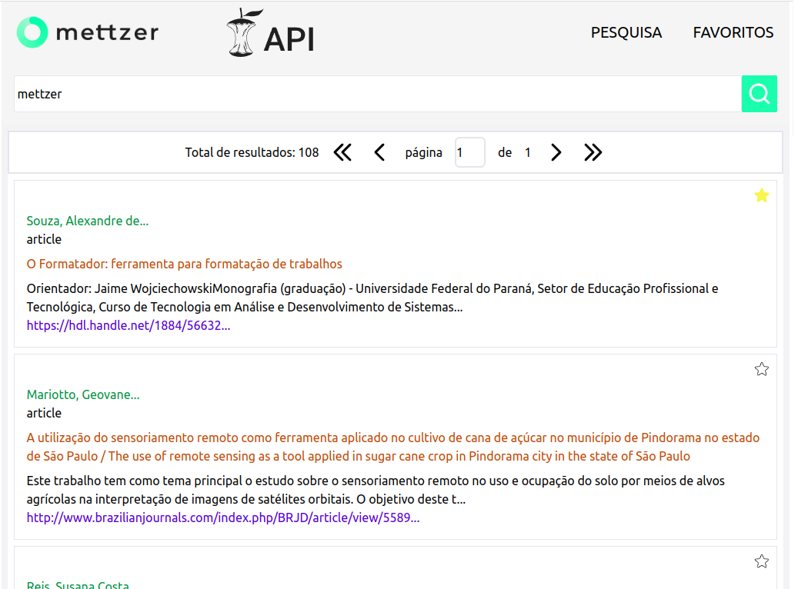
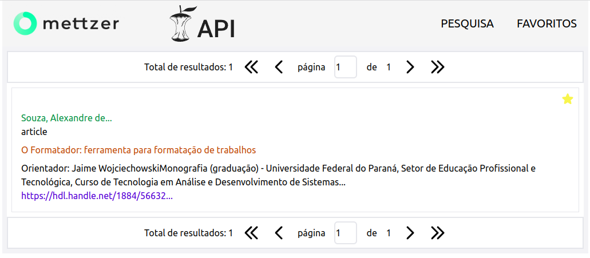

Seja bem vindo ao repositório do desafio Mettzer!
# Desafio-Mettzer
O Core API é o portal que cobre quase todo o conteúdo de acesso aberto, fornece API de fácil integração e possui um poderoso mecanismo de consulta de pesquisa.
O desafio é implementar uma aplicação utilizando frameworks JS, que oferece uma interface web com as seguintes funcionalidades:
  - [x] Deve ser possível buscar por artigos científicos na API do portal CORE https://core.ac.uk
  - Exibir na listagem:
      - authors
      - type
      - title
      - description
      - urls (devem ser clicáveis e abrir em uma nova aba)
  - [x] Deve ser possível marcar/desmarcar os resultados da pesquisa como favorito.
  - [x] Deve ter uma listagem com os artigos favoritados e ela deve estar disponível mesmo que a janela do navegador seja fechada e aberta novamente.
  - [x] As listagens, tanto da pesquisa quanto dos favoritos, devem ter paginação  

---

# Sumário

- [Status](#status)
- [Habilidades desenvolvidas](#habilidades-desenvolvidas)
- [Tecnologias utilizadas](#tecnologias-utilizadas)
- [Organização e Estruturação do Projeto](#organização-e-estruturação-do-projeto)
- [Pré-requisitos](#pré-requisitos)
  - [Ferramentas necessárias](#ferramentas-necessárias)
  - [Rodando no servidor local](#rodando-no-servidor-local)
- [Orientações de como utilizar](#orientações-de-como-utilizar)

  ---

# Status

Este projeto está concluído, porém sugestões de melhorias são sempre bem vindas!

---

# Habilidades desenvolvidas

- Desenvolvimento de telas com React, javascript e hooks
- Estilização e responsividade com Tailwindcss
- Implementação de testes utilizando jest e react-testing-library

---

# Tecnologias utilizadas

- [Node.js](https://nodejs.org/en/)
- [React](https://create-react-app.dev/docs/getting-started)
- [Phosphor React](https://www.npmjs.com/package/phosphor-react)
- [Tailwindcss](https://tailwindcss.com/docs/guides/create-react-app)
- [Axios](https://axios-http.com/ptbr/docs/intro)
- [Jest](https://jestjs.io/pt-BR/docs/getting-started)

---

# Organização e Estruturação do Projeto

O projeto está organizado e estruturado da seguinte maneira:
```
├── core-search
│   ├── package.json
│   ├── package-lock.json
│   ├── postcss.config.js
│   ├── public
│   │   ├── favicon.ico
│   │   ├── index.html
│   │   ├── logo_mettzer.png
│   │   ├── manifest.json
│   │   └── robots.txt
│   ├── src
│   │   ├── App.css
│   │   ├── App.js
│   │   ├── components
│   │   │   ├── NavBar.jsx
│   │   │   ├── Pagination.jsx
│   │   │   └── SearchBar.jsx
│   │   ├── helpers
│   │   │   └── request.jsx
│   │   ├── index.css
│   │   ├── index.js
│   │   ├── logo.svg
│   │   ├── __mocks__
│   │   │   └── axios.js
│   │   ├── pages
│   │   │   ├── Favorites.jsx
│   │   │   └── Home.jsx
│   │   ├── reportWebVitals.js
│   │   ├── routes
│   │   │   └── index.jsx
│   │   ├── setupTests.js
│   │   └── tests
│   │       ├── Favorites.test.js
│   │       ├── Home.test.js
│   │       ├── mettzerMock.js
│   │       └── RouterWrapper.jsx
│   └── tailwind.config.js
├── README.md
```

---
# Pré-requisitos

## Ferramentas necessárias

Para rodar o projeto, você vai precisar instalar as seguintes ferramentas:
 - [Git](https://git-scm.com);
 - [Node.js](https://nodejs.org/en/);
 - Um editor para trabalhar com o código como [VSCode](https://code.visualstudio.com/) ou outro de sua preferência;
 - [Documentação da API](https://core.ac.uk/docs/#!/all/search)
 - [Solicitar a chave de uso da API](https://core.ac.uk/services/api/)

 ## Rodando no servidor local

 - Clone o projeto e instale as dependências

    - Clone este repositório
    ```bash
    git clone https://github.com/LeandroGoerck/desafio-mettzer.git
    ```

    - Acesse a pasta do projeto no terminal/cmd
    ```bash
    cd desafio-mettzer/core-search
    ```

    - Instale as dependências
    ```bash
    npm install
    ```
    - Configure as variáveis de ambiente
    No ubuntu
    Em posse da chave de uso, digite o seguinte comando no ubuntu:
    ```bash
    export REACT_APP_API_KEY="sua_chave_de_uso"
    ```
    Se você estiver usando WSL, digite o comando:
    ```bash
    set REACT_APP_API_KEY="sua_chave_de_uso"
    ```  

 - Rode os testes:
    - Dentro da pasta core-search, digite o comando:
    ```bash
    npm test
    ```
    Digite a letra 'a' para rodar todos os testes


 - Inicie a aplicação:

    - Dentro da pasta core-search, digite o comando:
    ```bash
    npm start
    ```
    Abra em qualquer navegador http://localhost:3000/

---

# Orientações de como utilizar

A aplicação WEB possui duas telas. Os botões PESQUISA e FAVORITOS navegam por elas. 
A primeira tela apresentada ao usuário é a tela de pesquisa, onde basta digitar o termo desejado e clicar no botão com o ícone de lupa. A imagem abaixo ilustra a tela inicial de pesquisa:  
  

Os resultados retornados pela API CORE serão exibidos em forma de cards retangulares. O usuário dispõe de uma descrição do conteúdo e um link que o redireciona para o site do conteúdo original. A figura abaixo ilustra a exibição dos resultados da busca:  
  

O usuário pode adicionar seus artigos preferidos aos favoritos clicando no ícone da estrela. Para acessar a lista de artigos favoritos, basta clicar no botão FAVORITOS. A figura abaixo ilustra a tela de visualização dos artigos favoritos:  
  
